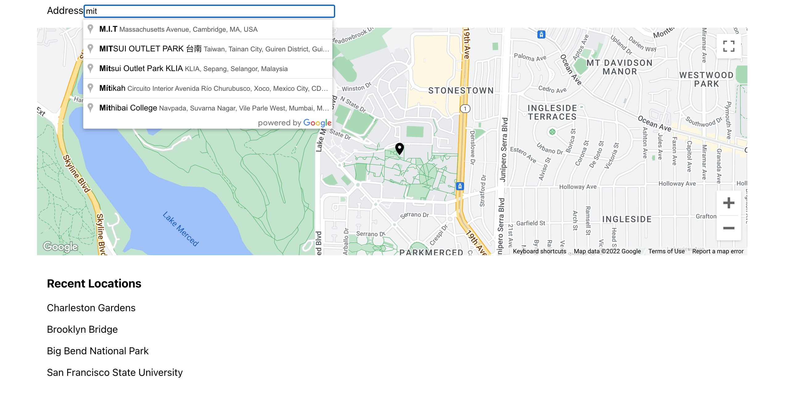
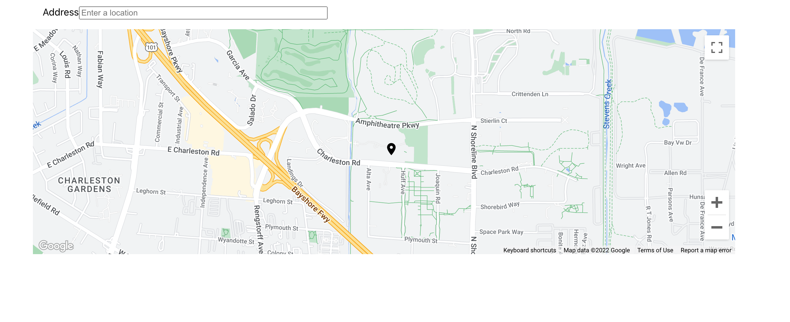

# Getting Started with Google Places Autocomplete
This project was bootstrapped with [Create React App](https://github.com/facebook/create-react-app).
## System Requirements
You’ll need to have Node >= 14.0.0 and npm >= 5.6 on your machine.\
[Install Node Js](https://nodejs.org/)

You need to install and run with yarn since this project uses Material UI with styled components.
[Install Yarn](https://classic.yarnpkg.com/lang/en/docs/install/)

Create an Google API Key in cloud console 
https://developers.google.com/maps/documentation/javascript/get-api-key
Provide access to below APIs

- Maps JavaScript API
- Places API

Add the API key to 
- [index.html](public/index.html)

- [AppConstants.ts](src/constants/AppConstants.ts)

## Getting Started
1. Open the terminal(Windows Command Prompt or PowerShell)
2. Navigate to the project folder.
3. Install yarn 
### `npm install --global yarn`
4. Run the following command to install the required dependencies.
###  `yarn`
4. Run the following command.
### `yarn start`
Runs the app in the development mode.\
Open [http://localhost:3000](http://localhost:3000) to view it in the browser.

The page will reload if you make edits.\
You will also see any lint errors in the console.
5. Running tests.
### `yarn test`

aunches the test runner in the interactive watch mode.\
See the section about [running tests](https://facebook.github.io/create-react-app/docs/running-tests) for more information.

6. Production deployment
### `yarn build`

Builds the app for production to the `build` folder.\
It correctly bundles React in production mode and optimizes the build for the best performance.

The build is minified and the filenames include the hashes.\
Your app is ready to be deployed!

In order to deploy you can upload the files `build` folder to an AWS s3 bucket and configure the necessary permission.

## UI Screens

### Initial View

### Search View

